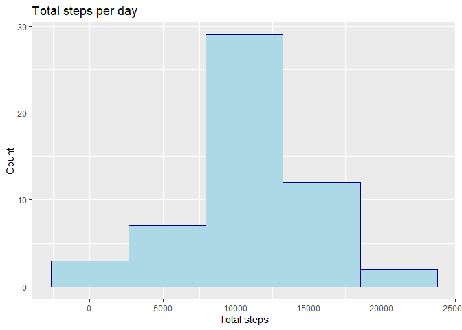
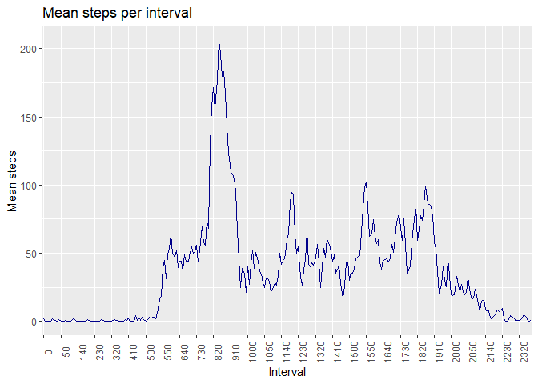
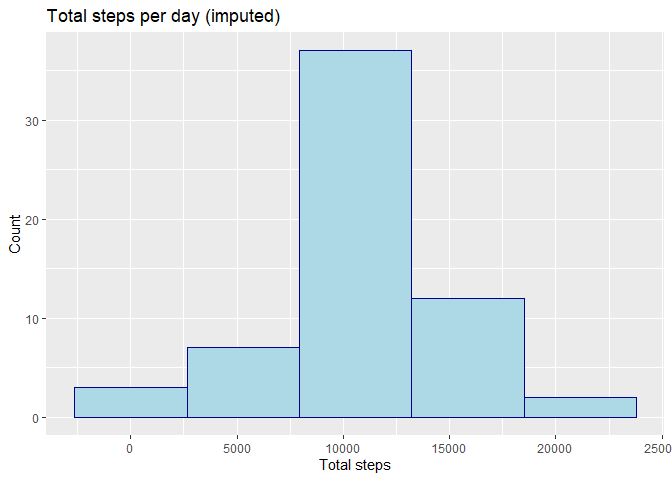
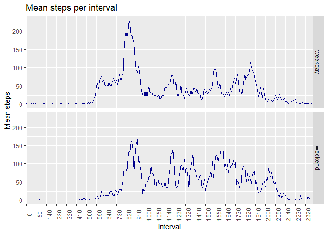

## Loading and preprocessing the data

Read the `activity.csv` file contained within zip-archive in the current directory. Convert dates to dates, and factorize the interval column


```r
data <- read.csv(unz("activity.zip", "activity.csv"))
data$date <- as.Date(data$date)
data$interval <- as.ordered(as.factor(data$interval))
```

## What is mean total number of steps taken per day?

Let's calculate total number of steps per day using `aggregate` function:


```r
total_per_day <- aggregate(list(steps = data$steps), list(date = data$date), sum)
```

...and plot it as histogram:


```r
library(ggplot2)
ggplot(total_per_day, aes(steps)) + 
  geom_histogram(bins = 5, color="darkblue", fill="lightblue") +
  labs(title = "Total steps per day", x = "Total steps", y = "Count")
```

<!-- -->

Calculate mean and median number of steps per day (removing NA values):


```r
mean(total_per_day$steps, na.rm = TRUE)
```

```
## [1] 10766.19
```

```r
median(total_per_day$steps, na.rm = TRUE)
```

```
## [1] 10765
```


## What is the average daily activity pattern?

First, calculate the average number of steps per each 5-minute interval (we have to remove NA values to produce a meaningful result):


```r
mean_per_interval <- aggregate(list(steps = data$steps), list(interval = data$interval), mean, na.rm = TRUE)
```

Then graph it as time series. `scale_x_discrete` is used to show only each 10th x-axis label.

```r
ggplot(mean_per_interval, aes(interval, steps, group = 1)) +
  geom_line(color = "darkblue") +
  scale_x_discrete(breaks = function(x) { x[c(TRUE, rep(FALSE, 9))] }) +
  theme(axis.text.x = element_text(angle = 90)) +
  labs(title = "Mean steps per interval", x = "Interval", y = "Mean steps")
```

<!-- -->

The interval for which there are maximum number of steps on average across all days is


```r
mean_per_interval[mean_per_interval$steps == max(mean_per_interval$steps), ]
```

```
##     interval    steps
## 104      835 206.1698
```

## Imputing missing values

Calculate number of missing values in the dataset:

```r
sum(is.na(data))
```

```
## [1] 2304
```

Let's fill missing values with mean across days for the missing interval. First, we'll write a function that processes each row and return a vector with imputed steps value. For each row, it returns the steps count if it is present or the mean for the given interval if it's not. We get mean for the interval from the already calculated data, for performace reasons. Then we use `apply` to get the data and set it into the copy of data.


```r
fill.with.mean <- function(row) {
  steps <- row[1]
  if (is.na(steps)) {
    steps <- mean_per_interval[mean_per_interval$interval == row[3], "steps"]
  }
  return(as.numeric(steps))
}

imputed_steps <- apply(data, 1, fill.with.mean)
```

Now, created a copy and replace the steps column with calculated value:


```r
imputed <- data.frame(data)
imputed$steps <- imputed_steps
```

Plot the histogram if imputed data per day:

```r
imputed_per_day <- aggregate(list(steps = imputed$steps), list(date = imputed$date), sum)
ggplot(imputed_per_day, aes(steps)) + 
  geom_histogram(bins = 5, color="darkblue", fill="lightblue") +
  labs(title = "Total steps per day (imputed)", x = "Total steps", y = "Count")
```

<!-- -->

Calculate mean and median on the imputed data:

```r
mean(imputed_per_day$steps)
```

```
## [1] 10766.19
```

```r
median(imputed_per_day$steps)
```

```
## [1] 10766.19
```

The mean stayed the same, but the median has changed and equals to mean with the imputed data.

## Are there differences in activity patterns between weekdays and weekends?

Let's add a new column, `weekday`, that tells if the given date is a weekday or a weekend. I also need to force English locale, as my system locale differs from it.


```r
Sys.setlocale("LC_ALL","English")
```

```
## [1] "LC_COLLATE=English_United States.1252;LC_CTYPE=English_United States.1252;LC_MONETARY=English_United States.1252;LC_NUMERIC=C;LC_TIME=English_United States.1252"
```

```r
is.weekday <- function(x) {
  date <- as.Date(x[2])
  if (weekdays(date, abbreviate = TRUE) %in% c("Sat", "Sun")) {
    return("weekend")
  } else {
    return("weekday")
  }
}

imputed$weekday <- as.factor(apply(imputed, 1, is.weekday))
```

Calculate imputed mean per interval:

```r
imputed_mean_per_interval <- aggregate(list(steps = imputed$steps), list(interval = imputed$interval, weekday = imputed$weekday), mean)
```

...and graph it:

```r
ggplot(imputed_mean_per_interval, aes(interval, steps, group = 1)) +
  geom_line(color = "darkblue") +
  facet_grid(rows = vars(weekday)) +
  scale_x_discrete(breaks = function(x) { x[c(TRUE, rep(FALSE, 9))] }) +
  theme(axis.text.x = element_text(angle = 90)) +
  labs(title = "Mean steps per interval", x = "Interval", y = "Mean steps")
```

<!-- -->
